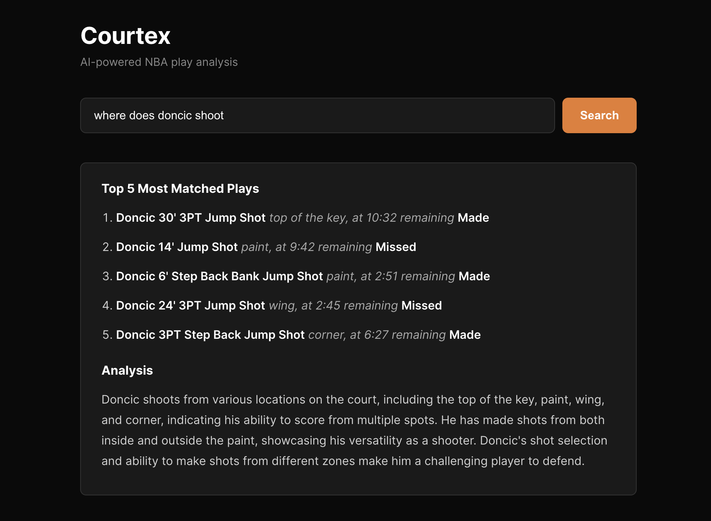
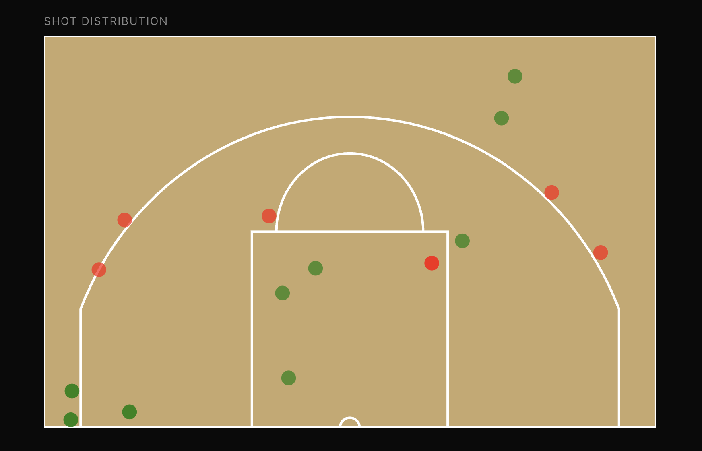

# Courtex

Ask any question about an NBA play from the 2024-25 season, get the top matched plays back as a written breakdown plus a shot chart showing where those shots were taken on the court.

Live demo: https://courtex.vercel.app




Courtex is a natural language interface for querying NBA shot data from the 2024-25 season. You ask a question in plain English, it retrieves semantically similar plays from a vector store, feeds them to an LLM with a structured prompt, and returns a written analysis alongside a shot chart rendered directly from the play coordinates. The backend is a FastAPI app deployed to AWS Lambda via Mangum, with Supabase as the vector database using pgvector for similarity search and Groq running Llama 3.3 70B for inference. The technically interesting part is the dual retrieval path: one query finds plays for the LLM context window, and a second pair of queries (biased toward "made" and "missed" variants of the same question) finds plays for the shot chart, so the visualization and the analysis are pulled independently rather than sharing a single result set.

## Architecture

```
Frontend (React)
    |
    | HTTP POST /query
    v
FastAPI (AWS Lambda via Mangum)
    |
    |-- retrieve_similar_plays() --> Supabase pgvector (top 5, LLM context)
    |-- retrieve_shot_chart_plays() --> Supabase pgvector (top 10 made + 10 missed, visualization)
    |
    |-- build_prompt() --> Groq API (Llama 3.3 70B)
    |
    v
{ answer: string, plays: Play[] }
    |
    v
React renders ReactMarkdown + D3 court diagram
```

## Stack

- Frontend: React, D3
- Backend: FastAPI, Python
- Inference: Groq (Llama 3.3 70B)
- Vector DB: Supabase with pgvector
- Embeddings: sentence-transformers (all-MiniLM-L6-v2)
- Deployment: AWS Lambda + Lambda Function URL, Vercel (frontend)

## Local Setup

**Prerequisites:** Python 3.11+, Node 18+, a Supabase project with pgvector enabled, a Groq API key.

**Backend**

```bash
cd Courtex
python3 -m venv venv
source venv/bin/activate
pip install -r requirements.txt
```

Create a `.env` file in the project root:

```
SUPABASE_URL=your_supabase_url
SUPABASE_KEY=your_supabase_anon_key
GROQ_API_KEY=your_groq_api_key
```

Start the server:

```bash
PYTHONPATH=backend uvicorn backend.api.main:app --reload
```

**Frontend**

```bash
cd frontend
npm install
npm start
```

The React app runs on `http://localhost:3000` and proxies queries to `http://localhost:8000` by default. For production, set `REACT_APP_API_URL` to your Lambda Function URL in `frontend/.env.production`.

## Data Pipeline

Shot data is pulled from the NBA Stats API's play-by-play endpoints and ingested into Supabase. Run these once to populate the database:

```bash
# Pull shot data from the NBA API and load into Supabase
python backend/data/ingest.py

# Generate and store embeddings for all plays
python backend/data/embed.py
```

`ingest.py` fetches the first 200 games of the 2024-25 season via `PlayByPlayV3`, filters to made and missed shot events, and upserts into a `plays` table. `embed.py` batches all rows without embeddings through `all-MiniLM-L6-v2` and writes the vectors back to Supabase.

The Supabase table needs a `match_plays` RPC function backed by pgvector for the similarity queries to work.

## Project Structure

```
backend/
  api/          FastAPI app and Lambda handler
  rag/          Retrieval pipeline, prompt builder, and retriever
  data/         Ingestion and embedding scripts
  embeddings/
frontend/
  src/
    App.js          Main app, fetch logic, state
    CourtDiagram.js D3 SVG court renderer
```
